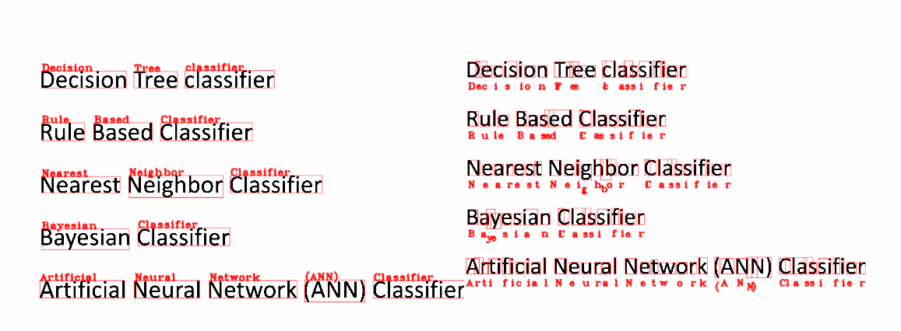

# PRATYASHA-A-deep-learning-approach-for-Visual-Impairment

## Overview

PRATYASA is a mobile-based application designed to significantly enhance the independence and accessibility of visually impaired individuals. By leveraging advanced machine learning and computer vision techniques, the application provides real-time environment description, Nepali currency recognition, and optical character recognition (OCR). These features enable users to interact with their surroundings more effectively, helping them navigate unfamiliar environments, recognize currency, and read text from documents or objects.

The project uses several state-of-the-art machine learning models, such as Convolutional Neural Networks (CNN), ResNet101, and InceptionV3, combined with Flutter for mobile development to ensure a seamless and user-friendly experience.

## Introduction

Visually impaired individuals often face various challenges in their daily lives, such as recognizing objects in their environment, handling currency, or reading text. Existing assistive technologies, while helpful, often fall short in providing detailed or intuitive information in real-time. PRATYASA aims to address these shortcomings by incorporating the following key features:

- **Environment Description**: Utilizing a CNN-based InceptionV3 model for feature extraction and a transformer for caption generation, the app provides real-time, audible descriptions of the surrounding environment.
- **Currency Recognition**: PRATYASA includes a Nepali currency recognition feature powered by a ResNet101 model, trained on seven different classes of Nepali currency, achieving an accuracy of 96%.
- **Optical Character Recognition (OCR)**: By integrating Tesseract’s LSTM-based OCR, the app can convert printed text into voice output, allowing users to read documents, books, menus, and more.

The app is developed using Flutter for mobile interaction, where users can input images for any of the three tasks and receive voice output. The goal is to empower visually impaired individuals by providing them with greater independence, improving their daily activities, and fostering inclusivity in their interactions with the world.

## Abstract

This project, PRATYASA, leverages AI and machine learning to enhance the quality of life for visually impaired individuals through a smartphone application. It features environment description, Nepali currency recognition, and optical character recognition (OCR). Utilizing Convolutional Neural Networks (CNN) and ResNet101, the currency detection achieved 96% accuracy across seven classes of Nepali currency. For environment captioning, the InceptionV3 architecture extracts image features, while a transformer generates captions. Tesseract’s LSTM-based OCR facilitates text reading from images. The Flutter-based app provides an intuitive interface, enabling users to receive voice outputs for various tasks, ultimately fostering independence and inclusivity in daily activities.

## Working Flowchart

The following flowchart illustrates the overall workflow of the PRATYASA project:


*Figure: Working flowchart of overall system*


# Currency Detection Model

## Overview
The Currency Detection Model is designed to identify and classify Nepali currency notes using Convolutional Neural Networks (CNNs). Leveraging the ResNet101 architecture, the model effectively extracts features from images, allowing for accurate detection across varying real-world conditions.

## Datasets
- **Custom Dataset**: A diverse collection of images of Nepali currency taken in various lighting, angles, and backgrounds.
- **Kaggle Dataset**: Contains seven classes of Nepali currency notes: 5, 10, 20, 50, 100, 500, and 1000.

 
*Figure: Sample representing all labels of currency*

## Preprocessing Steps
1. **Image Resizing**: All images resized to 224x224 pixels for uniform input.
2. **Data Augmentation**: Techniques applied include random rotation, flipping, zooming, and normalization of pixel values to enhance dataset diversity.
3. **Image Adjustment**: Reduces computational load and enhances quality using convolution and median filtering.


## CNN Architecture using ResNet101
The model employs a Convolutional Neural Network (CNN) architecture based on ResNet101, which excels in hierarchical feature extraction through skip connections that mitigate vanishing gradient issues. The model is trained using hyperparameter tuning to optimize performance.

 
*Figure: CNN Architecture

## Training
- **Architecture**: ResNet101
- **Optimizer**: Adam with a learning rate of 0.001.
- **Loss Function**: Sparse categorical cross-entropy suitable for multi-class classification.
- **Hyperparameter Tuning**: Focused on optimizing critical parameters such as learning rate and number of epochs.
- **Callbacks**: Includes ModelCheckpoint, EarlyStopping, and ReduceLROnPlateau for optimizing training performance.


## Visualization and Output
The model's output includes predictions of the detected currency note classes, displayed in a user-friendly format.


| Currency Output 1        | Currency Output 2        | Currency Output 3        |
|--------------------------|--------------------------|--------------------------|
|  |  |  |

*Figure: Example outputs of the currency detection model.*

 
*Fig: Confusion matrix for 5 classes*

## Training and Validation Metrics

The following plots show the training and validation accuracy and loss during the training of the currency detection model using ResNet101.

| Training and Validation Accuracy         | Training and Validation Loss           |
|------------------------------------------|----------------------------------------|
|  |  |

*Figure: Training and validation metrics of the model.*

 


## Conclusion
This model aims to provide accurate and efficient currency detection, enhancing usability for visually impaired individuals and contributing to inclusivity through technology.

# Optical Character Recognition (OCR) Model

## Overview
The Optical Character Recognition (OCR) Model utilizes the Tesseract engine to recognize text within images and scanned documents. This model successfully detects characters, words, and text through a series of preprocessing steps and a sophisticated pipeline architecture.

 

## Image Preprocessing
1. **Grayscale Conversion**: Converts the input image to grayscale for standardized processing.
2. **Noise Reduction**: Applies thresholding and filtering to eliminate unwanted artifacts.
3. **Binarization**: Converts the grayscale image to binary format to distinguish text from the background.
4. **Skew Correction**: Straightens tilted text to improve alignment and recognition accuracy.
5. **Contrast Enhancement**: Adjusts contrast and brightness for better visibility.

## Model Architecture
The Tesseract OCR engine follows a multi-stage pipeline architecture that incorporates:

- **Connected Component Analysis (CCA)**: Identifies and labels connected components or blobs in the image.
- **Bounding Box Creation**: Generates bounding boxes around identified characters.
- **Grouping and Word Segmentation**: Organizes bounding boxes into lines of text and individual words.

 

## Model Output
The model effectively recognizes characters and words, displaying them with bounding boxes for clarity.


| OCR Output 1                   | OCR Output 2                        |
|------------------------------------------|----------------------------------------|
|  |  |

## API Integration
An API was created to facilitate the OCR process, allowing images to be uploaded via POST requests and returning recognized text in a structured format. The TTS module reads the recognized text aloud for user accessibility.

## Challenges
While the OCR model achieved accurate recognition, challenges were encountered, such as difficulty in recognizing handwritten text and certain font styles, which necessitated further preprocessing techniques.

## Conclusion
This OCR model leverages Tesseract's capabilities to provide an effective solution for text recognition, contributing to accessibility and usability for diverse applications.

# Environment Captioning Model

## Overview
The Environment Captioning Model is a deep learning framework designed to generate descriptive captions for images depicting various environments. By leveraging a combination of Convolutional Neural Networks (CNNs) and transformer architectures, this model can effectively capture and articulate the contextual essence of an image, making it applicable for a wide range of tasks in computer vision and natural language processing.

 
*Overview of the Environment Captioning Model Architecture*
*Source: Cespedes, J. [From Scratch Implementation of Neural Image Captioning](https://www.linkedin.com/pulse/from-scratch-implementation-neural-image-captioning-jorge-cespedes/).*

## Dataset
- **Dataset Used**: Flickr30k
  - **Total Images**: 30,000
  - **Training Set**: 80% (24,000 images)
  - **Validation Set**: 20% (6,000 images)

The Flickr30k dataset comprises images with corresponding captions, providing a rich source of training data for our model. The dataset was meticulously divided into training and validation subsets to ensure robust evaluation.


## Model Architecture
The model consists of two main components:

1. **Base Model**: InceptionV3
   - The InceptionV3 model is a powerful CNN pretrained on the ImageNet dataset, which serves as the backbone for feature extraction from input images. It efficiently captures high-level features while reducing computational costs.

2. **Caption Generation**: Transformer
   - The transformer model is employed for generating captions based on the features extracted by the CNN. This model was trained from scratch, allowing it to learn the intricacies of language specific to the environmental context depicted in the images.


## Training
- **Total Epochs**: 50
- **Learning Rate**: 0.001
- **Optimizer**: Adam
- **Input Image Size**: Resized to (256x256x3)

The training process involved feeding the model with images and their corresponding captions to learn the relationships between visual features and textual descriptions. 

## Hyperparameter Tuning
To achieve optimal model performance, hyperparameter tuning was extensively conducted. The key hyperparameters focused on include:

- **Learning Rate**: Set to 0.001, balancing convergence speed and model stability.
- **Batch Size**: Experimented with different batch sizes to determine the most effective for training speed and memory usage.
- **Epochs**: Trained for a maximum of 50 epochs, monitoring for signs of overfitting.
  
The tuning process allowed us to refine these parameters, enhancing the model's ability to generate accurate and contextually appropriate captions.


## Output

The following images demonstrate the captioning results produced by the environment captioning model. Each image is displayed alongside its generated caption.

|  |  |
|:-----------------------------------------------------------------------------:|:-----------------------------------------------------------------------------:|
| *Caption 1*                                                                  | *Caption 2*                                                                  |

|  |  |
|:-----------------------------------------------------------------------------:|:-----------------------------------------------------------------------------:|
| *Caption 3*                                                                  | *Caption 4*                                                                  |


## User Interface

The PRATYASA app features a user-friendly interface designed specifically for blind individuals, integrating **Flutter** for the front end and **Flask** for backend communication with the machine learning model. Key functionalities include:

1. **Speech Guidance**: Spoken instructions guide users through the app, enhancing navigation.
2. **Gesture Control**: Users interact via taps, triggering different functionalities based on tap counts: 
   - One tap for **OCR** 
   - Two taps for **Currency Detection** 
   - Three taps for **Environment Captioning**.
3. **OCR Functionality**: Users can capture and receive spoken feedback from printed text in images.
4. **Currency Detection**: The app identifies currency notes using the camera and provides verbal predictions.
5. **Environment Captioning**: Images of surroundings are captured and described vocally, providing contextual awareness.
6. **Speech Feedback**: The **Flutter TTS** package delivers information and instructions audibly, ensuring accessibility.
7. **Timer-based Interaction**: This feature prevents unintended taps by controlling the listening period for user gestures.
8. **Dynamic Image Capture**: The app tailors image capture to the selected functionality based on user gestures.


*Figure: Simple UI for overall system consists of gesture control for 3 different options.*
The intuitive design of the PRATYASA app significantly enhances the mobile experience for visually impaired users, promoting independence and accessibility.


## Usage
To utilize the Environment Captioning Model, clone the repository and install the required dependencies:
```bash
git clone <repository-url>
pip install -r requirements.txt


Feel free to contact me for any questions or further information. You can connect with me on [LinkedIn](https://www.linkedin.com/in/prasanna-ghimire-002335188?utm_source=share&utm_campaign=share_via&utm_content=profile&utm_medium=android_app
).

